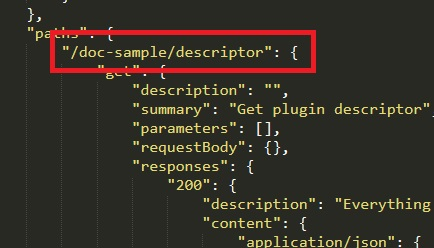

# Descriptor

[<= Main menu](https://github.com/Psychopoulet/node-pluginsmanager-plugin)

* [Resume](#resume)
* [Descriptor interactions](#descriptor-interactions)

## Resume

> It's the more critical stuff, which describe all the plugin's interactions and will be used by all your executives classes

> This is NOT a js file, but a json OpenAPI file

It's loaded and shared by the [Orchestrator](./Orchestrator.md) and used by
* [Mediator](./Mediator.md) to check input data
* [Server](./Server.md) to manage plugin's API paths and find the rigth Mediator's method to call

## Descriptor interactions

> See [Descriptor sample](./Descriptor.json)

### Server

#### Paths

#### HTTP usable methods

#### Mediator method called

### Mediator

#### Method called by the server

#### First method parameter (url parameters)

#### Second method parameter (body parameters)

#### Method return

