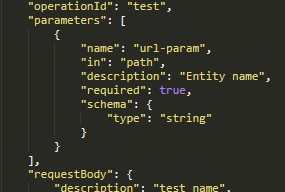

# Mediator

[<= Architecture](./architecture.md)

* [Resume](#resume)
* [Class](#class-extends-descriptoruser)
* [Descriptor interactions](#descriptor-interactions)
* [Sample](#sample)

## Resume

> It's the most important class, which contains the all plugin's logic.

You will have to add all the methods you need here to pilote the targeted use (API, device, etc...)

## Interfaces

```typescript
interface iMediatorCheckParametersResult {
  "url": object;
  "body": object;
}
```

## Class (extends [DescriptorUser](./DescriptorUser.md))

### Attributes

#### public

  * ``` public initialized: boolean; ``` mediator status

### Methods

  * ``` public checkParameters(operationId: string, urlParams: object, bodyParams: object, contentType: string): Promise<iMediatorCheckParametersResult>; ``` Check sended parameters by method name and formate it if necessary ("true" => true, "1.1" => 1.1, etc...) (used by the [Server](./Server.md))

### Events

  * ``` initialized ``` fired when mediator is initialized
  * ``` released ``` fired when mediator is released

## Descriptor interactions

> See [Descriptor sample](./Descriptor.json)

  * Method called by the Server


  * First method parameter (url parameters)



  * Second method parameter (body parameters)


  * Method return


## Sample

```javascript
"use strict";

const { get } = require('https');
const { Mediator } = require('node-pluginsmanager-plugin');

class MyPluginMediator extends Mediator {

  constructor (opts) {

    super(opt);

    this._url = "";

  }

  _initWorkSpace () {

    this._url = "https://www.google.fr/search?q=";

    return Promise.resolve();

  }

  _releaseWorkSpace () {

    this._url = "";

    return Promise.resolve();

  }

  _query (search) {

    return new Promise((resolve, reject) => {

      get(this._url + search, (res) => {

          res.setEncoding("utf8");

          let rawData = "";

          res.on("error", (err) => {
            reject(err);
          }).on("data", (chunk) => {
            rawData += chunk;
          }).on("end", () => {
            resolve(rawData);
          });

      });

    }).then((content) => {

      return Promise.resolve({
        "search": search,
        "content": content
      });

    });

  }

  page1 () {
    return this._query("page1");
  }

  page2 () {
    return this._query("page2");
  }


  /**
  * Execute "test" search
  * @param {object} urlParameters: parameters sended with url (path, query)
  * @param {object} bodyParameters: parameters sended in the query body
  * @param {string} contentType: type of content type detected by the Server and setted in the Descriptor (probably "application/json")
  * @return {Promise} operation result
  */
  test (urlParameters, bodyParameters, contentType) {

    /*
    urlParameters : {
      "url-param": string
    }
    */

    /*
    bodyParameters : {
      "body-param": string
    }
    */

    return this._query(urlParameters["url-param"] + "_" + bodyParameters.["body-param"]);

  }

}
```
