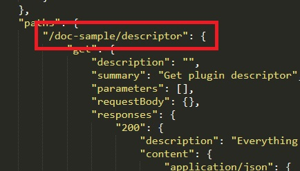
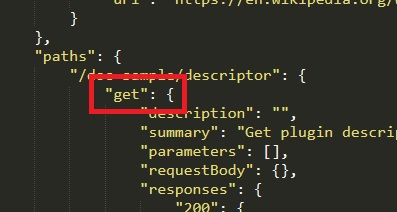
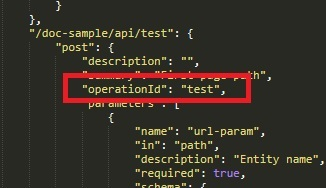

# Server

[<= Main menu](https://github.com/Psychopoulet/node-pluginsmanager-plugin)

* [Resume](#resume)
* [Class](#class-extends-mediatoruser)
* [Conventions](#conventions)
* [Descriptor interactions](#descriptor-interaction)
* [Sample](#sample)

## Resume

Plugin's API.

Expose the [Mediator](./Mediator.md)'s methods with the [Descriptor](./Descriptor.md) rules.

> You doesn't need any developpement in this part if you does not use sockets, everything is automaticly provided by the [Descriptor](./Descriptor.md).

> If you use sockets, you can extends this class and re-write "socketMiddleware" method

## Class (extends [MediatorUser](./MediatorUser.md))

### Methods

#### public

> Please note the fact that "init" and "release" method MUST NOT be re-writted. Each child has is own init logic.

  * ``` public appMiddleware(req: Request, res: Response, next: Function): void; ``` middleware for express (& others) to add routes
  * ``` public socketMiddleware(server: WebSocketServer): void; ``` middleware for socket to add bilateral push events, should be re-writted if used

## Conventions

### REST

  * GET => read data
  * PUT => add data
  * POST => edit data
  * DELETE => remove data

### Callable urls

  * "/[plugin-name]/descriptor" [GET] : return json [Descriptor](./Descriptor.md) (already and automaticly setted, no need for "operationId" data in the [Descriptor](./Descriptor.md) for this path)
  * "/[plugin-name]/api/[path]" : expose API path

### Used HTTP statusCode

  * [200](https://developer.mozilla.org/fr/docs/Web/HTTP/Status/200) (everything is fine with a content)
  * [201](https://developer.mozilla.org/fr/docs/Web/HTTP/Status/201) (everything is fine for POST request, with and/or without content)
  * [204](https://developer.mozilla.org/fr/docs/Web/HTTP/Status/204) (everything is fine without any content)
  * [400](https://developer.mozilla.org/fr/docs/Web/HTTP/Status/400) (the request does not match with the [Descriptor](./Descriptor.md))
  * [500](https://developer.mozilla.org/fr/docs/Web/HTTP/Status/500) (the [Mediator](./Mediator.md) generate an unknown error)
  * [501](https://developer.mozilla.org/fr/docs/Web/HTTP/Status/501) (there is no "operationId" for this path in the [Descriptor](./Descriptor.md) or the [Mediator](./Mediator.md) does not have the "operationId" method given by the [Descriptor](./Descriptor.md))

## Descriptor interactions

> See [Descriptor sample](./Descriptor.json)

### Paths



### HTTP usable methods



### Mediator method called



## Sample

```javascript
"use strict";

const { Server } = require('node-pluginsmanager-plugin');

class MyPluginServer extends Server {

  constructor (opt) {

    super(opt);

    this._socketServer = null;
    this._onConnection = null;

  }

  _releaseWorkSpace () {

    return this._socketServer ? Promise.resolve().then(() => {

      if ("function" === typeof this._onConnection) {

        this._socketServer.removeListener("connection", this._onConnection);
        this._onConnection = null;

      }

      this._socketServer = null;

    }) : Promise.resolve();

  }

  socketMiddleware (socketServer) {

    this._socketServer = socketServer;
    this._onConnection = (socket) => { // not declared as a method to avoid "this" reference problems

      console.log('connected');

      socket.on('message', function close(payload) {
        console.log('message', payload);
      }).on('close', function close() {
        console.log('disconnected');
      });

    };

    this._socketServer.on("connection", this._onConnection);

  }

}
```
