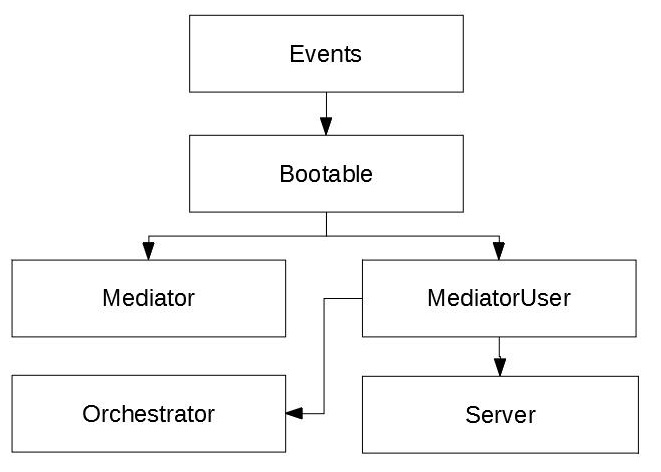
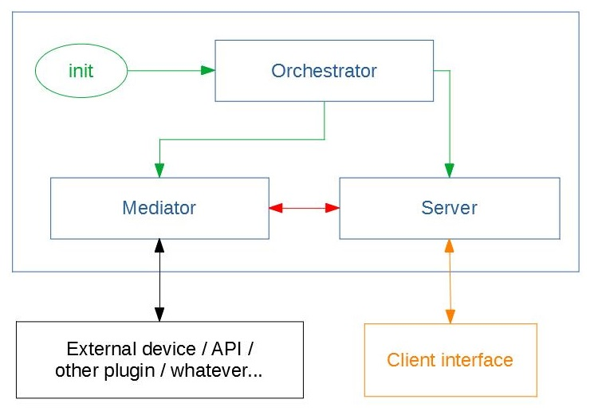

# Architecture

[<= Main menu](https://github.com/Psychopoulet/node-pluginsmanager-plugin//README.md)

## Inheritence

## Functional

## Classes resume

### [Descriptor](./Descriptor.md)

[OpenAPI](https://swagger.io/specification/) json file.

> It's the more critical stuff, which describe all the plugin's interactions and will be used by all your executives classes

It's loaded and shared by the [Orchestrator](./Orchestrator.md) and used by
* [Mediator](./Mediator.md) to check input data
* [Server](./Server.md) to manage plugin's API paths and find the rigth Mediator's method to call

### [EventEmitter](https://nodejs.org/api/events.html#events_class_eventemitter)

All the following classes can use there own events, following your needs

### [DescriptorUser](./DescriptorUser.md)

All the following classes can use the [Descriptor](./Descriptor.md) shared by the [Orchestrator](./Orchestrator.md), and check its validity with the "checkDescriptor" method

More, the class add features like external ressources directory (to create files like local sqlite without impact the plugin's installation) and 4 init/release methods

### [Mediator](./Mediator.md)

> It's the most important class, which contains the all plugin's logic.

You will have to add all the methods you need here to pilote the targeted use (API, device, etc...)

### [MediatorUser](./MediatorUser.md)

All the following classes can use the [Mediator](./Mediator.md)

### [Server](./Server.md)

Plugin's API.

Expose the [Mediator](./Mediator.md)'s methods with the [Descriptor](./Descriptor.md) rules.

### [Orchestrator](./Orchestrator.md)

Check, initialize (and/or release) and execute the other main classes ([Mediator](./Mediator.md) and [Server](./Server.md))
